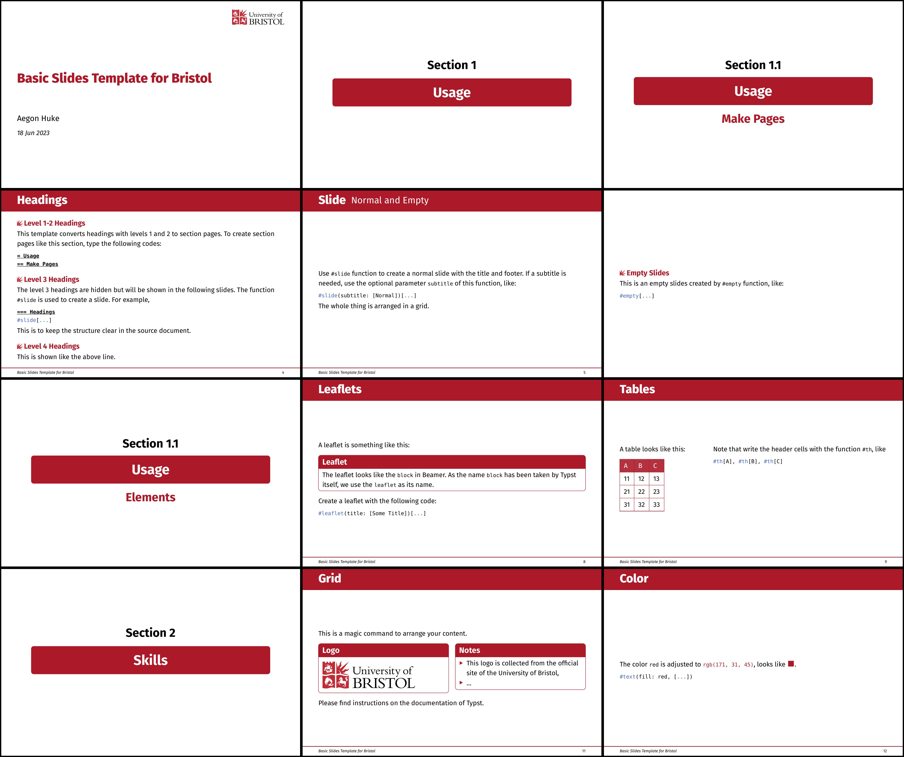

# Slides with Theme University of Bristol in Typst

This is a template for creating slides with the theme of the University of Bristol in Typst.

## Functions

```typ
#let slides(
  title: "",
  authors: (),
  date: datetime.today(),
  short-title: "",
  body
)
```

This function changes page, text and layout settings to prepare for slides.

```typ
#let slide(body, subtitle: [])
```

This function creates a slide and can append a subtitle after its title.
Its title is specified in the nearest former level-3 headings, i.e., headings of marker `===`.

```typ
#let empty(content)
```

This function creates an empty slide.

```typ
#let leaflet(content, title: [])
```

This function creates a block area with a header and body, which looks like the `\block{}` command in Beamer.
As the name `block` has been taken by Typst itself, it is named to `leaflet` instead.

## Syntax Maps

Headings are translated into specific parts:

- The level-1 and level-2 headings are mapped to the section page and the subsection page.
- The level-3 headings are stored as slide titles and hidden. They only show up once the `#slide` is called to create a new slide.

## Example

[](./example.pdf)


